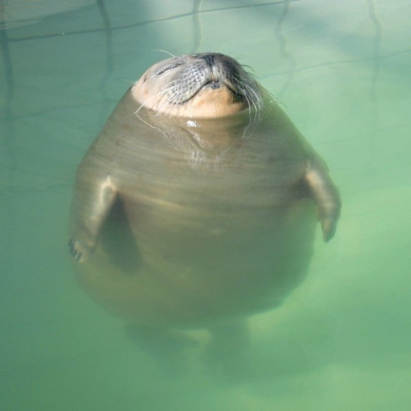
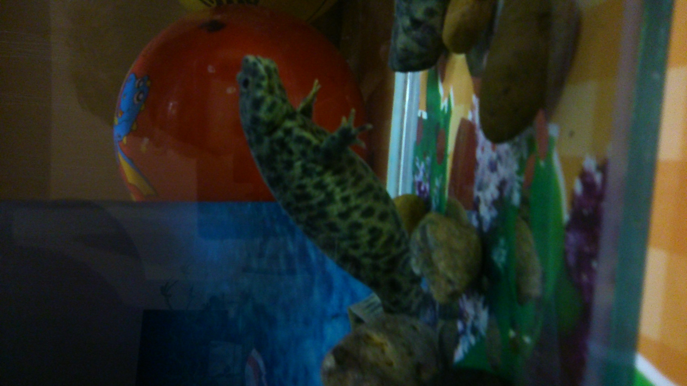

# Мысли вслух

Имя - Марина. 
- Родилась в СССР в 1969 году. 
- За плечами - детский сад, школа, затем 5 лет в Институте инженеров железнодорожного транспорта.
  
Стараюсь не унывать, как вот эта счастливая животинка.

_____________
Дети и внуки живут отдельно. Сейчас воспитываю тритошу.

____________________

Также имеются 3 кошки,но тут уже они меня воспитывают. Но кошек я люблю всех.
Моё мнение о кошках тут:
[смешная кошка](https://bipbap.ru/wp-content/uploads/2018/02/ko1.jpg)

## Немного непонятного 

Учусь, потому что хочу себя реализовать. Все на работе заняли выжидательную позицию.Смотрят со скептицизмом и любопытством, говорят, что зря трачу время.

______________________
# *А я хочу только вперёд!!!*

